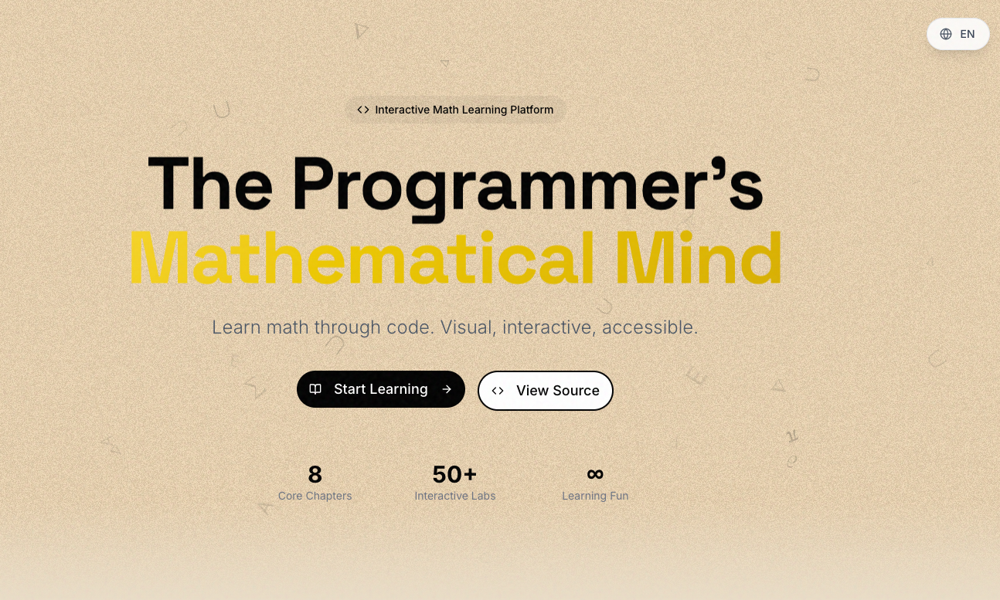

# CodeMath

<p align="center">
  <b>🎮 Explore computer science mathematics through interaction & visualization</b>
</p>

<p align="center">
  <a href="README.zh.md">🇨🇳 中文</a> | <b>🇺🇸 English</b>
</p>

<p align="center">
  <a href="https://react.dev/"></a>
  <a href="https://www.typescriptlang.org/"></a>
  <a href="https://vitejs.dev/"></a>
  <a href="https://threejs.org/"></a>
  <a href="LICENSE"></a>
</p>

---

<p align="center">
  <a href="https://codemath.pages.dev/" target="_blank">
    
  </a>
</p>

<p align="center">
  <a href="https://codemath.pages.dev/" target="_blank"><b>🚀 Live Demo → https://codemath.pages.dev/</b></a>
</p>

## Introduction

CodeMath is an interactive math learning platform built with React + TypeScript. Through rich animations, 3D effects, and interactive demonstrations, it helps learners understand core mathematical concepts in computer science.

---

## Tech Stack

| Tech | Usage |
|------|-------|
| React 19 | Frontend Framework |
| TypeScript | Type Safety |
| Vite | Build Tool |
| Tailwind CSS | Styling |
| shadcn/ui | UI Components |
| GSAP | Animation |
| Three.js | 3D Rendering |
| KaTeX | Math Formulas |
| Lenis | Smooth Scroll |

---

## Quick Start

### One-Click Start

```bash
cd CodeMaths
./start.sh
```

Visit: **http://localhost:5173/**

### Stop Service

```bash
./stop.sh
```

### View Logs

```bash
tail -f logs/startup.log
```

---

## Startup Script Features

| Feature | Description |
|---------|-------------|
| 🌏 Smart Registry | Auto-detect China mainland, switch to Taobao npm registry |
| 📦 Auto Install | Auto-install dependencies on first run |
| 🔄 Background Run | Run server in background |
| 📝 Logging | All output to `logs/startup.log` |
| 🔒 Process Management | Auto-detect duplicate starts, PID saved to `logs/vite.pid` |

---

## Project Structure

```
CodeMaths/
├── app/                    # Main application
│   ├── src/
│   │   ├── components/     # Reusable components
│   │   ├── sections/       # Page sections
│   │   ├── chapters/       # Chapter interactives
│   │   ├── hooks/          # Custom hooks
│   │   ├── lib/            # Utilities
│   │   └── i18n/           # i18n configuration
│   ├── package.json
│   └── vite.config.ts
├── logs/                   # Logs directory
├── start.sh                # Start script ⭐
├── stop.sh                 # Stop script ⭐
├── README.md               # Project README
└── tech-spec.md            # Tech specification
```

---

## Learning Chapters

| Chapter | Topic | Interactive Content |
|:---:|:---|:---|
| Ch.1 | The Story of Zero | Base converter, bitwise visualization |
| Ch.2 | Logic | Logic gate playground, truth table generator |
| Ch.3 | Remainders | Day calculator, chess magic trick |
| Ch.4 | Mathematical Induction | Domino simulator |
| Ch.5 | Permutations & Combinations | Card lab, Venn diagrams |
| Ch.6 | Recursion | Tower of Hanoi, fractals |
| Ch.7 | Exponential Explosion | Paper folding, binary vs linear search |
| Ch.8 | Unsolvable Problems | Halting problem simulator |
| Appendix | Machine Learning | Perceptron training ground |

---

## Manual Installation

```bash
cd app
npm install
npm run dev      # Start dev server
npm run build    # Build for production
npm run preview  # Preview production build
```

---

## Internationalization

This project supports Chinese/English bilingual switching. Language files are located in `app/src/i18n/`.

---

## FAQ

**Q: What if port 5173 is occupied?**

A: Run `./stop.sh` to stop existing process, or manually change port in `app/vite.config.ts`.

**Q: How to switch npm registry?**

A: Script auto-detects environment. Manual switch:
```bash
npm config set registry https://registry.npmmirror.com  # Taobao
npm config set registry https://registry.npmjs.org      # Official
```

**Q: Dependency installation failed?**

A: Delete `app/node_modules` and `app/package-lock.json`, then re-run `./start.sh`.

---

## Acknowledgments

This project is inspired by the book "Mathematics for Programmers" (程序员的数学) by [Hiroshi Yuki](https://www.hyuki.com/). The chapter topics and learning path are based on the book's structure, while all code implementations, interactive components, and visualizations are original work.

---

## License

[MIT](LICENSE)

---

<p align="center">
  💡 <b>Math shouldn't be just formulas and theorems — it should be tangible and explorable.</b>
</p>
